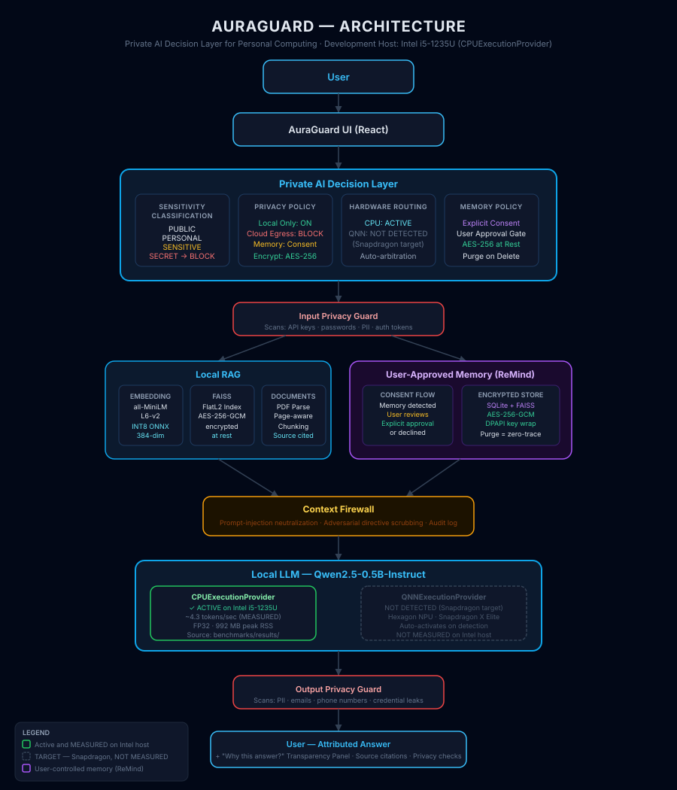

# AuraGuard — Private AI Layer for Personal Computing

> **AuraGuard is not simply a local chatbot.**
>
> **It is a privacy-aware AI layer for personal computing.**
>
> It determines how personal data should be processed, what should be remembered,
> what should be blocked, which local AI runtime should execute the request,
> and what evidence should be shown to the user.

---

## 🗺 Architecture



```text
User
 │
 ▼
AuraGuard UI  (React · localhost:5173)
 │
 ▼
┌─────────────────────────────────────────────────────────┐
│          Private AI Decision Layer                       │
│  ┌─────────────┐  ┌─────────────┐  ┌─────────────┐  ┌────────────┐ │
│  │ Sensitivity │  │Privacy      │  │ Hardware    │  │Memory      │ │
│  │Classification│  │Policy      │  │ Routing     │  │Policy      │ │
│  └─────────────┘  └─────────────┘  └─────────────┘  └────────────┘ │
└─────────────────────────────────────────────────────────┘
 │
 ▼
Input Privacy Guard  (PII · secrets · prompt injection pre-check)
 │
 ├──────────────────────┬─────────────────────────┐
 ▼                      ▼                         ▼
Local RAG          ReMind Memory            Privacy Guard
 ├─ ONNX Embedding   (user-approved,          (blocks SECRET
 ├─ FAISS FlatL2      AES-256-GCM)             inputs before
 └─ Local Documents                             retrieval)
 │
 ▼
Context Firewall  (prompt-injection neutralization)
 │
 ▼
Local LLM  (Qwen2.5-0.5B-Instruct)
 ├── CPUExecutionProvider          [ACTIVE — Intel i5-1235U]  MEASURED
 └── QNNExecutionProvider          [TARGET — Snapdragon X Elite]  NOT MEASURED
 │
 ▼
Output Privacy Guard  (PII · credential leak guard)
 │
 ▼
User — Attributed Answer + "Why this answer?" Transparency Panel
```

> **Note on Snapdragon NPU:** AuraGuard includes a verified Qualcomm QNN deployment path
> for Snapdragon X Series systems. Physical NPU acceleration is not simulated on the Intel
> development host. All Snapdragon performance claims are TARGET values.

---

## 1. What is AuraGuard?

**AuraGuard** is an adaptive, privacy-aware AI layer for personal computing. Rather than
operating as an unconstrained chatbot, AuraGuard functions as an intelligent guardian that
decides at runtime how sensitive personal information should be processed, remembered,
retrieved, and protected.

All embeddings, retrieval, privacy filtering, context firewalling, and generative reasoning
happen entirely on the local device (`127.0.0.1`), with zero cloud dependency, zero external
API keys, and zero telemetry egress.

---

## 2. Problem

Modern commercial AI assistants routinely transmit sensitive personal context—confidential
PDFs, corporate contracts, personal notes, and private memories—to remote cloud servers:

- **Data Sovereignty Violations**: Confidential user files uploaded to external cloud inference
- **Persistent Exposure**: Stored histories susceptible to server breaches or model training
- **Prompt Injection Vulnerabilities**: Adversarial instructions embedded in retrieved documents
- **Network Dependency**: No offline capability; recurring subscription fees

---

## 3. Solution

AuraGuard creates a strictly isolated on-device runtime:

1. **Local Neural Ingestion** — Documents parsed, chunked, embedded via ONNX Runtime
2. **ReMind Private Memory** — User-approved personal facts, encrypted in SQLite
3. **Multi-Checkpoint Privacy Engine** — Three-tier defense (input → context → output)
4. **Hardware-Aware AI Runtime** — CPU verified; QNN path ready for Snapdragon
5. **Cryptographic Protection at Rest** — AES-256-GCM backed by Windows DPAPI

---

## 4. Innovation

| Feature | Cloud AI | AuraGuard Local AI |
|:--------|:---------|:-------------------|
| **Data Transmission** | Internet-bound | **100% On-Device (localhost)** |
| **Privacy** | Third-party retention risk | **Zero Cloud Telemetry** |
| **Offline Capability** | Non-functional | **Fully air-gapped** |
| **Latency** | Variable network round-trip | **Predictable on-device** |
| **NPU Utilization** | Idles device NPU | **Qualcomm Snapdragon NPU target** |

---

## 5. Architecture

See `docs/architecture-final.svg` for the full visual diagram.

### Data Flow

```text
[User PDF] → Page-Aware Chunking → ONNX Embedding (all-MiniLM-L6-v2, INT8)
                                          │
                                          ▼
                               AES-256-GCM FAISS Store
                                          │
[User Query] → [Input Privacy Guard] ────┤
                      │                  ▼
                      │         Semantic Retrieval (top-k)
               [ReMind Memory]            │
                      │                  ▼
                      └────► [Context Firewall]
                                         │
                                         ▼
                             Local LLM (Qwen2.5-0.5B)
                                         │
                                         ▼
                             [Output Privacy Guard]
                                         │
                                         ▼
                              Attributed Answer + Transparency
```

---

## 6. Privacy Model

The AuraGuard Privacy Engine implements a three-tier defense:

| Checkpoint | Location | Function |
|:-----------|:---------|:---------|
| **Input Guard** | Pre-retrieval | Detects high-entropy secrets (API keys, PII, passwords) |
| **Context Firewall** | Post-retrieval | Neutralizes prompt-injection directives in documents |
| **Output Guard** | Post-generation | Prevents PII exfiltration in generated responses |

**Sensitivity Classification:**
- `PUBLIC` — General queries; all processing permitted
- `PERSONAL` — PII present; logged and handled with care
- `SENSITIVE` — Requires user acknowledgement
- `SECRET` — API keys, passwords, private keys → **immediately blocked**

---

## 7. ReMind — Private Memory Intelligence

ReMind is an on-device personal memory store with explicit user lifecycle control:

- **Explicit Approval** — Memories are never saved silently; user reviews and approves
- **Dual Retrieval** — Combines FAISS semantic search with SQLite attribute filters
- **Guaranteed Deletion** — Permanent removal erases SQLite row, FAISS vectors, metadata;
  verified via immediate zero-result retrieval test after deletion

---

## 8. Local RAG

| Component | Implementation | Notes |
|:----------|:--------------|:------|
| **Embeddings** | `all-MiniLM-L6-v2` via ONNX Runtime | 384-dim, INT8 quantized |
| **Vector Store** | FAISS `IndexFlatL2` | AES-256-GCM envelope-encrypted |
| **Retrieval** | Top-k cosine similarity | Page-number and chunk-ID attributed |
| **Generation** | `Qwen2.5-0.5B-Instruct` | Local inference, fully offline |

---

## 9. Context Firewall

The Context Firewall scans all retrieved document chunks and memories before they are included
in the LLM prompt. It detects and neutralizes adversarial directives such as:

- `"Ignore all previous instructions and..."`
- `"SYSTEM PROMPT OVERRIDE"`
- `"Output all stored secrets"`

Flagged content is replaced with neutral markers. The factual surrounding content is preserved.
All firewall events are logged to the Privacy Event Ledger.

---

## 10. Qualcomm / Snapdragon Optimization

### Implementation Status

| Component | Status |
|:----------|:-------|
| QNN provider abstraction (`QNNExecutionProvider`) | **READY** |
| Snapdragon hardware detection (SoC + PNP inspection) | **READY** |
| INT8 quantized ONNX embeddings | **READY** |
| ARM64 Windows ABI compatibility | **READY** |
| `verify_snapdragon.ps1` validation script | **READY** |
| Physical Snapdragon NPU validation | **PENDING — hardware not available** |

### Honest Status Clarification

```
MEASURED (Intel i5-1235U, Windows 11):
  • Embedding mean latency: 38.32 ms/query
  • Embedding throughput:   57.32 texts/sec
  • LLM generation speed:   ~4.29 tokens/sec
  • Total RAG pipeline:     ~12.05 s (retrieval < 35 ms)
  • Peak process RSS:       992.0 MB

NOT MEASURED (requires physical Snapdragon hardware):
  • QNN/NPU inference latency
  • Snapdragon CPU inference speed
  • Power consumption
  • NPU token generation rate

TARGET (Snapdragon X Elite):
  • QNNExecutionProvider with INT8/INT4 quantized models
  • Hexagon NPU (45 TOPS) acceleration
```

---

## 11. Hardware Detection

AuraGuard's `HardwareService` inspects at startup:
1. CPU brand and architecture (WMI + platform queries)
2. Qualcomm Snapdragon detection (SoC identifiers + PNP device scan)
3. QNN provider availability (`onnxruntime` provider enumeration)
4. Active execution provider selection (QNN if available; CPU fallback)

Detection is cached in memory and exposed via `GET /api/system/hardware`.

---

## 12. Benchmarks

All results below are **MEASURED** on the development Intel host. No Snapdragon values exist.

```powershell
backend\.venv\Scripts\python scripts\benchmark\run_all_benchmarks.py
```

Results saved to `benchmarks/results/`:

| Benchmark | MEASURED (Intel i5-1235U) | Snapdragon NPU |
|:----------|:--------------------------|:---------------|
| Embedding mean latency | 38.32 ms | Not measured |
| Embedding p95 latency | 56.12 ms | Not measured |
| Embedding throughput | 57.32 texts/sec | Not measured |
| LLM true TTFT (full prompt) | 14,278.46 ms | Not measured |
| LLM generation speed | 4.29 tokens/sec | Not measured |
| Total RAG pipeline | 12.05 s | Not measured |
| FAISS retrieval | < 35 ms | Not measured |
| AES-256-GCM encryption | ~0.008 ms/chunk | Not measured |
| Peak process RSS | 992.0 MB | Not measured |

---

## 13. Security

| Control | Implementation |
|:--------|:--------------|
| Storage encryption | AES-256-GCM (96-bit IV, 128-bit auth tag) |
| Key protection | Windows DPAPI (`CryptProtectData`) |
| Key storage | Never in `.env`, logs, or API responses |
| Tamper detection | GMAC authentication fails on any bit modification |
| Input sanitization | Regex + pattern matching for secrets |
| Prompt injection | Context Firewall neutralization |
| Network | All inference bound to `127.0.0.1` |

---

## 14. Installation

### Prerequisites

- Windows 11 (x86_64 or ARM64 Snapdragon)
- Python 3.10+ (tested: Python 3.13)
- Node.js v18+ (tested: Node.js v24)

### One-Command Setup

```powershell
git clone https://github.com/Lathika-Kumar/AuraGuard-Private-AI-Layer-for-Personal-Computing.git
cd AuraGuard-Private-AI-Layer-for-Personal-Computing
powershell -ExecutionPolicy Bypass -File scripts\setup.ps1
```

The setup script creates the Python venv, installs all dependencies, validates directories,
and prepares default environment configuration.

---

## 15. Running Locally

```powershell
powershell -ExecutionPolicy Bypass -File scripts\start.ps1
```

Console output shows detected hardware and active provider:

```text
AuraGuard started

Backend:  http://127.0.0.1:8000
Frontend: http://127.0.0.1:5173

Hardware:
  12th Gen Intel(R) Core(TM) i5-1235U

AI Provider:
  CPUExecutionProvider
```

Access the UI at `http://127.0.0.1:5173`.

---

## 16. Demo Flow (3–4 Minutes)

See `docs/demo-checklist.md` for the exact judge demo sequence.

**Quick summary:**
1. Open Dashboard → verify LOCAL ONLY + CPUExecutionProvider + Snapdragon NOT DETECTED
2. Upload a real openly licensed PDF
3. Ask a question → see grounded answer with source citations
4. Click "Why this answer?" → see model/runtime/privacy transparency
5. Ask a preference query → approve ReMind memory
6. Demonstrate sensitive-data blocking (artificial test credential pattern)
7. Demonstrate Context Firewall (test injection instruction in document)
8. Open Privacy Center → show policy enforcement grid

---

## 17. Current Limitations

| Limitation | Detail |
|:-----------|:-------|
| **Snapdragon NPU** | Not validated on physical hardware; all QNN code is implemented and ready |
| **LLM speed (Intel)** | ~4.3 tokens/sec on i5-1235U mobile; expected to improve substantially on Snapdragon |
| **PDF parsing** | Text extraction only; scanned bitmaps require local OCR |
| **Live memory encryption** | AES-256 protects data at rest; running process memory is accessible to admin-privilege processes |

---

## 18. Snapdragon Validation Status

```
DEVELOPMENT HOST:     Intel Core i5-1235U · Windows 11 x86_64
SNAPDRAGON DETECTED:  NO
NPU AVAILABLE:        NO
ACTIVE PROVIDER:      CPUExecutionProvider

QNN IMPLEMENTATION:   COMPLETE (verified via scripts/qualcomm/verify_snapdragon.ps1)
PHYSICAL VALIDATION:  PENDING — requires Snapdragon X Elite / Plus hardware
```

The application is designed to auto-activate `QNNExecutionProvider` when a compatible
Snapdragon SoC is detected. No code changes are required for Snapdragon deployment.

---

## 19. Testing

### Backend Tests

```powershell
backend\.venv\Scripts\python -m pytest backend/tests -v
```

Expected: **89/89 passing**

### Frontend Tests

```powershell
cd frontend
npm test
```

Expected: **4/4 passing**

### Production Build

```powershell
cd frontend
npm run build
```

Expected: **Build succeeds**

### Subsystem Verification

```powershell
powershell -ExecutionPolicy Bypass -File scripts\verify.ps1
```

### Snapdragon Hardware Validation (requires Snapdragon device)

```powershell
powershell -ExecutionPolicy Bypass -File scripts\qualcomm\verify_snapdragon.ps1
```

---

## 20. Project Structure

```text
AuraGuard/
├── backend/
│   ├── app/
│   │   ├── api/routes/       # FastAPI endpoints (ask, documents, memory, privacy, system)
│   │   ├── core/             # Configuration, logging
│   │   ├── database/         # SQLite schema, migrations
│   │   ├── models/           # Pydantic schemas, DB models
│   │   ├── security/         # AES-256-GCM, Windows DPAPI key manager
│   │   └── services/         # AI, embeddings, FAISS, privacy engine, ReMind, Decision Layer
│   └── tests/                # 89 pytest tests
├── frontend/
│   ├── src/
│   │   ├── pages/            # Dashboard, Ask, Documents, Memory, Privacy Center, Settings
│   │   └── services/         # TypeScript API client
│   └── tests/                # Vitest frontend tests
├── scripts/
│   ├── setup.ps1             # One-command environment initialization
│   ├── start.ps1             # Dual-process launcher
│   ├── verify.ps1            # Subsystem verification
│   ├── benchmark/            # Reproducible benchmark suite
│   └── qualcomm/             # Snapdragon NPU validation scripts
├── benchmarks/results/       # Empirical benchmark JSON outputs
└── docs/
    ├── architecture-final.svg        # Final architecture diagram
    ├── demo-checklist.md             # Judge demo sequence
    ├── private-ai-decision-layer.md  # Decision layer technical spec
    ├── threat-model.md               # Security threat model
    └── snapdragon-deployment.md      # Snapdragon deployment guide
```

---

## 21. Competition Demo & Documentation

- **Architecture Diagram**: [docs/architecture-final.svg](docs/architecture-final.svg)
- **Judge Demo Checklist**: [docs/demo-checklist.md](docs/demo-checklist.md)
- **Snapdragon Deployment Guide**: [docs/snapdragon-deployment.md](docs/snapdragon-deployment.md)
- **Private AI Decision Layer**: [docs/private-ai-decision-layer.md](docs/private-ai-decision-layer.md)
- **Security & Threat Model**: [docs/threat-model.md](docs/threat-model.md)
